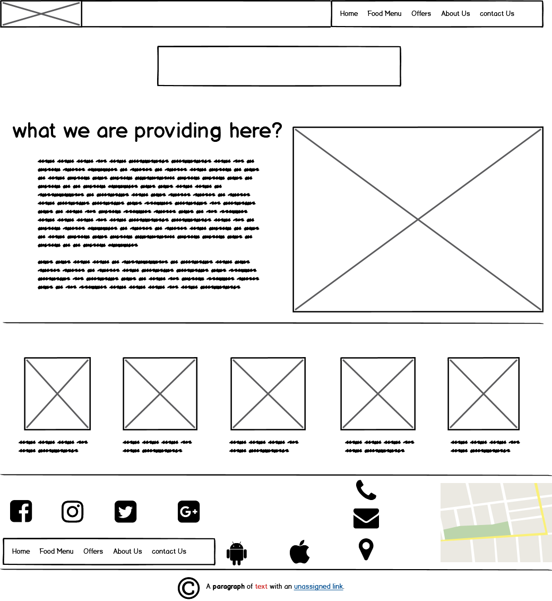
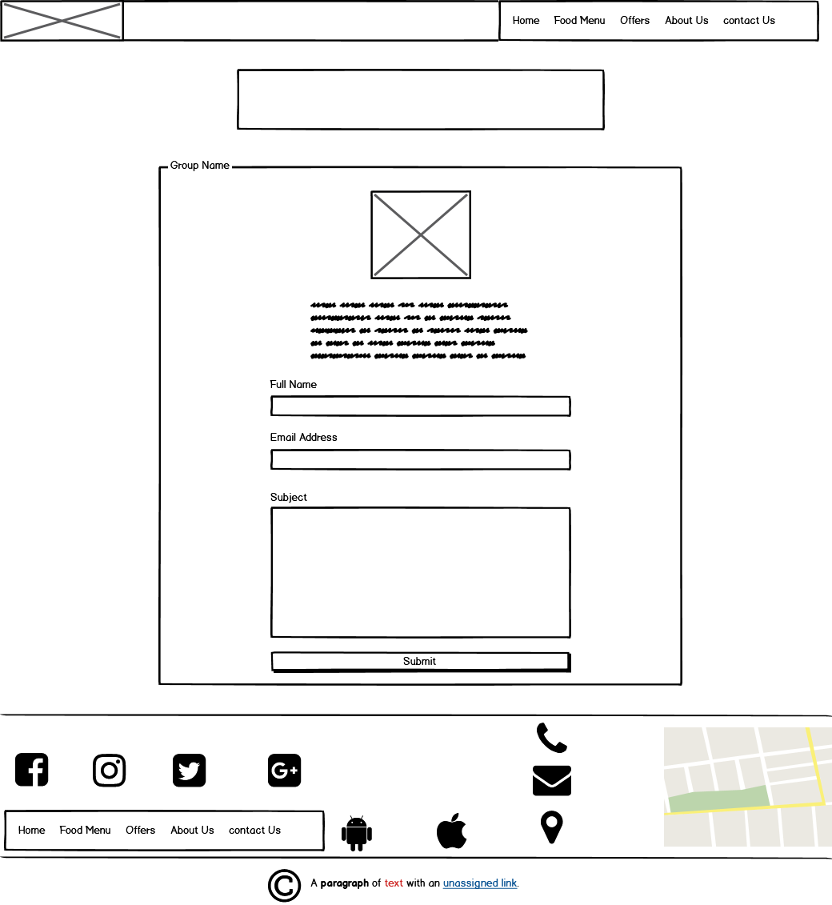

# **Fat Guys Restaurant**

this project is built using only HTML & CSS, it's a restaurant's website template.

## Project purpose:

---

- This project was made for learning purposes, it's an assignment (Task 4) for ASAC LTUC, to build a website template using only HTML & CSS.

---

## Project wireframe:

---

- ### Homepage wireframe:

---

- ### Contact Page wireframe:

---

###### [Fontawesome 6.1.1](https://fontawesome.com/) | [Follow Me](https://github.com/BasharAlzrigat) | made with love ♥
